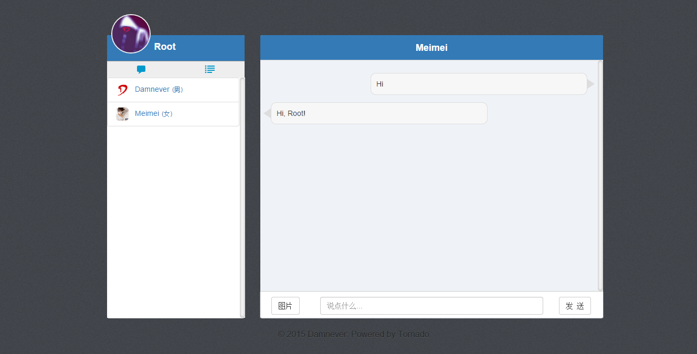
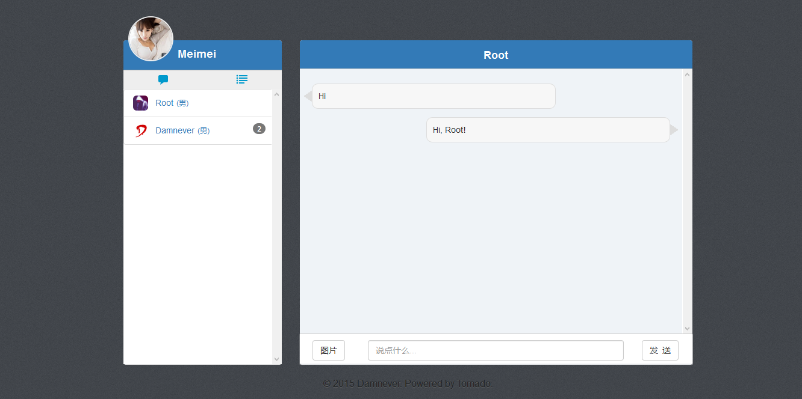

## Chat Room (To Be Continued)

Powered by Tornado, MySQL, Redis, Bootstrap, jQuery.

---

### Summary

- **Tornado**: Using long polling, rather than WebSocket.
- **MySQL**: Storing user informations，UUIDs that is what email verification and password recovery need.
- **Redis**：Storing online users, and through Pub-Sub to push online/offline messages, chat messages.
- **AJAX**: Verifying forms, including sign-up, log-in, password recovery, etc.
- **Email Verification**: Sign-up, password recovery.
- **Online/offline**: Using long polling to indicate user if online.
- **New Messages**: If received message from the user is not current chat user, showing the number of unread message. Otherwise, showing messages in chat box. In addition, pictures is ok!




---

### Requirements

```pip install -r requirements.txt```

See: [requirements.txt](./requirements.txt)

---

### TO-DO

- Robot: http://www.tuling123.com/openapi/cloud/access_api.jsp
- When sending email, page would blocking, maybe task queue?
- When user offline, clear up messages?
- Through other sites of OAuth login?
- A kinds of BUGs，to be continued O(∩_∩)O~

### LICENSE

[The BSD 3-Clause License](./LICENSE)
